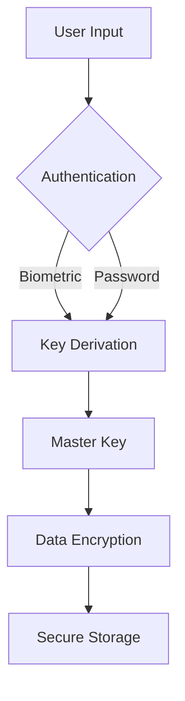

# Monark Password Manager

[](https://tauri.app)
[](https://react.dev)
[](https://www.rust-lang.org)

Offline-first, cross-platform password manager with military-grade encryption.

## Features
- 🔒 Argon & ChaCha20-Poly1305 encryption
- 📱 Cross-platform (Windows/macOS/Linux/Android/iOS)
- 📈 Privacy first

## Installation
```bash
# Clone repository
git clone https://github.com/xilistudios/monark.git
cd monark
# Install dependencies
bun install
cd src-tauri && cargo install && cd ..

# Development (Linux)
WEBKIT_DISABLE_DMABUF_RENDERER=1 bun tauri dev

# Production build
bun tauri build
```

## Security Architecture


## API Documentation
- [Tauri Commands](docs/tauri-commands.md)
- [Cryptographic Protocols](docs/crypto.md)
- [Redux Store Structure](docs/redux-state.md)

## Contributing
1. Follow [coding standards](.roo/rules/02-react.md)
2. Implement TypeScript type safety
3. Add comprehensive Vitest coverage
4. Document changes in [Memory Bank](projectbrief.md)

## License
AGPL-3.0 © 2025 Monark Security