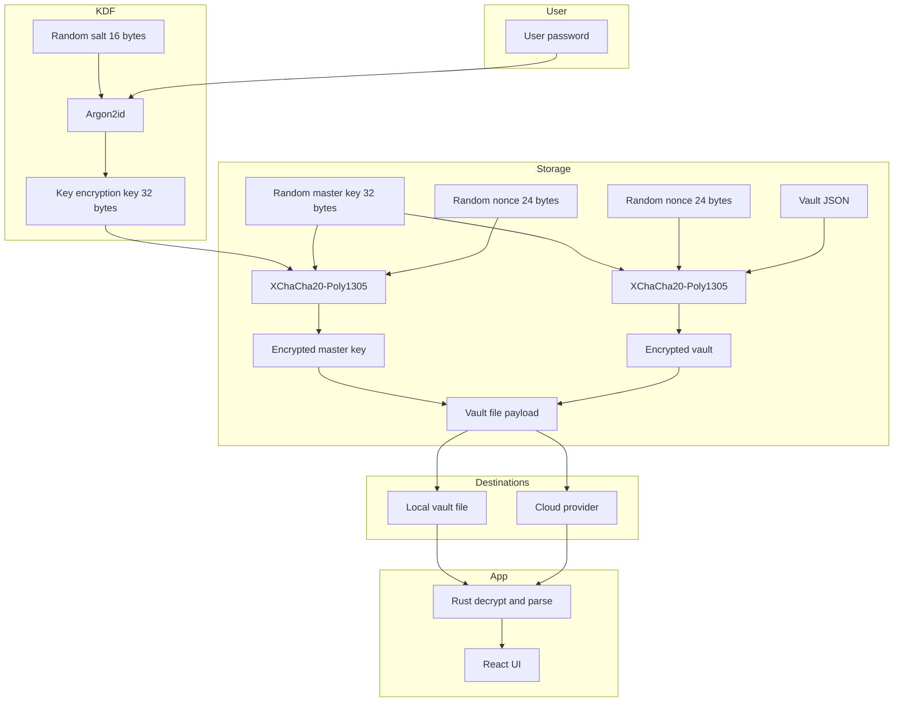

# Monark Password Manager

[](https://github.com/xilistudios/monark/releases)
[](https://github.com/xilistudios/monark/actions/workflows/tauri-release.yml)
[](#license)

[](https://tauri.app)
[](https://react.dev)
[](https://www.rust-lang.org)
[](https://tailwindcss.com)
[](https://vitest.dev)
[](https://biomejs.dev)

Offline-first, cross-platform password manager built with Tauri + Rust. Monark keeps your vaults encrypted end-to-end and works reliably even when you are offline.

- **Offline-first**: local vaults by default, plus optional cloud sync
- **Privacy-first**: your data stays yours; encryption happens on-device
- **Cross-platform**: desktop and mobile via Tauri v2

---

## Table of contents

- [Key features](#key-features)
- [Security architecture](#security-architecture)
- [Tech stack](#tech-stack)
- [Getting started](#getting-started)
  - [Prerequisites](#prerequisites)
  - [Install dependencies](#install-dependencies)
  - [Development](#development)
  - [Testing](#testing)
  - [Build](#build)
- [Project structure](#project-structure)
- [Documentation](#documentation)
- [Contributing](#contributing)
- [License](#license)

---

## Key features

- **Local vaults**: encrypted vault files stored on your device.
- **Google Drive cloud sync**: sync encrypted vaults to your own Drive.
- **Cloud is still offline-first**: cloud vaults are cached locally for resiliency.
- **Cross-platform**: Windows, macOS, Linux, Android, iOS (Tauri v2).
- **Modern UI**: React + Tailwind CSS.

Cloud vault storage uses a provider abstraction in the Rust backend (see [`src-tauri/src/storage/providers/mod.rs`](src-tauri/src/storage/providers/mod.rs:1)).

---

## Security architecture

Monark's security model is designed so that:

- encryption/decryption happens in the Rust backend
- vault data is encrypted before writing to disk or uploading to cloud providers
- sensitive Rust structures use zeroization for safer memory handling (see [`src-tauri/src/models.rs`](src-tauri/src/models.rs:30))

### Cryptography (current implementation)

- **Key derivation**: Argon2id (RFC 9106 family)
  - Default parameters are set in [`src-tauri/src/vault/lifecycle.rs`](src-tauri/src/vault/lifecycle.rs:13)
    - memory: 65536 KiB (64 MiB)
    - iterations: 3
    - parallelism: 4
- **Encryption**: XChaCha20-Poly1305 AEAD
  - Key length: 32 bytes (256-bit) in [`src-tauri/src/crypto/constants.rs`](src-tauri/src/crypto/constants.rs:2)
  - Nonce length: 24 bytes (192-bit) in [`src-tauri/src/crypto/constants.rs`](src-tauri/src/crypto/constants.rs:3)
  - Salt length: 16 bytes in [`src-tauri/src/crypto/constants.rs`](src-tauri/src/crypto/constants.rs:4)

### Vault file integrity notes

- XChaCha20-Poly1305 provides authenticated encryption (tampering is detected during decrypt).
- Vault files also include a lightweight format marker prefix (`p->monark/`) used as a basic sanity check before parsing (see [`src-tauri/src/io/signature.rs`](src-tauri/src/io/signature.rs:4)).
- The in-memory vault structure contains an `hmac` field (see [`src-tauri/src/models.rs`](src-tauri/src/models.rs:45)), but HMAC enforcement is not currently part of the vault read/write lifecycle.

### Data flow diagram



Cloud vault caching (offline-first behavior) is implemented in [`src-tauri/src/vault/cloud_lifecycle.rs`](src-tauri/src/vault/cloud_lifecycle.rs:40).

---

## Tech stack

Frontend:

- Tauri API v2 (see dependency in [`package.json`](package.json:17))
- React 18 (see [`package.json`](package.json:38)) with TypeScript type packages (see [`package.json`](package.json:49))
- Tailwind CSS v4 (see [`package.json`](package.json:42))
- TanStack Router (see [`package.json`](package.json:20))

Backend:

- Rust (edition 2021) (see [`src-tauri/Cargo.toml`](src-tauri/Cargo.toml:6))
- Tauri v2 (see [`src-tauri/Cargo.toml`](src-tauri/Cargo.toml:21))
- Cryptography crates: `argon2`, `chacha20poly1305`, `zeroize` (see [`src-tauri/Cargo.toml`](src-tauri/Cargo.toml:30))

Tooling:

- Biome (formatter + linter) (see [`package.json`](package.json:45))
- Vitest + Testing Library (see [`package.json`](package.json:11))

---

## Getting started

### Prerequisites

- Rust toolchain (stable)
- Bun or Node.js
- Tauri CLI (v2)

On Linux, you may need additional system packages for Tauri/WebKit. The CI workflow lists known-good dependencies (see [` .github/workflows/tauri-release.yml`](.github/workflows/tauri-release.yml:64)).

### Install dependencies

Bun is used by default in the Tauri config (see [`src-tauri/tauri.conf.json`](src-tauri/tauri.conf.json:7)).

```bash
bun install
```

### Development

Monark uses a fixed dev server URL for Tauri (see [`src-tauri/tauri.conf.json`](src-tauri/tauri.conf.json:8)).

1) Start the frontend dev server:

```bash
bun run dev
```

2) In a second terminal, run the Tauri app:

```bash
bun run tauri dev
```

Script sources:

- Dev server: [`dev`](package.json:7)
- Tauri CLI: [`tauri`](package.json:10)

### Testing

```bash
# Frontend unit and integration tests
npm run test

# Run once
npm run test:run

# Coverage
npm run test:coverage

# Rust tests
npm run test:rust
```

Script sources: [`scripts`](package.json:6).

### Build

```bash
# Build frontend bundle
bun run build

# Build Tauri bundles
bun run tauri build
```

Build hooks are configured in [`src-tauri/tauri.conf.json`](src-tauri/tauri.conf.json:6).

---

## Project structure

- Frontend application entry: [`src/main.tsx`](src/main.tsx:1)
- UI routes (TanStack Router): [`src/routes/__root.tsx`](src/routes/__root.tsx:1)
- Vault UI components: [`src/components/Vault/VaultSelector.tsx`](src/components/Vault/VaultSelector.tsx:1)
- Cloud storage service wrapper: [`src/services/cloudStorage.ts`](src/services/cloudStorage.ts:1)
- Vault manager singleton (frontend runtime orchestration): [`src/services/vault.ts`](src/services/vault.ts:463)

Rust backend:

- Tauri command registration: [`src-tauri/src/lib.rs`](src-tauri/src/lib.rs:81)
- Local vault lifecycle commands: [`src-tauri/src/vault/lifecycle.rs`](src-tauri/src/vault/lifecycle.rs:17)
- Cloud vault lifecycle commands: [`src-tauri/src/vault/cloud_lifecycle.rs`](src-tauri/src/vault/cloud_lifecycle.rs:102)
- Storage provider implementations: [`src-tauri/src/storage/providers/google_drive.rs`](src-tauri/src/storage/providers/google_drive.rs:1)
- Vault file format structures: [`src-tauri/src/models.rs`](src-tauri/src/models.rs:8)

---

## Documentation

- Cryptography overview: [`docs/crypto-architecture.md`](docs/crypto-architecture.md)
- Vault format and boundaries: [`docs/vault-format.md`](docs/vault-format.md)
- Cloud storage architecture: [`docs/cloud-storage-architecture.md`](docs/cloud-storage-architecture.md)
- Redux architecture: [`docs/redux-state.md`](docs/redux-state.md)
- Security audit notes: [`docs/security-audit.md`](docs/security-audit.md)
- Cloud testing guide: [`docs/testing-cloud-storage.md`](docs/testing-cloud-storage.md)

---

## Contributing

Contributions are welcome.

### Development workflow

- Follow the repo conventions documented in [`AGENTS.md`](AGENTS.md).
- Use Biome formatting and lint rules (see [`biome.json`](biome.json)).
- Prefer tests for behavior changes (Vitest for frontend, `cargo test` for Rust).

### Commands

- Start dev server: [`npm run dev`](package.json:7)
- Run tests: [`npm run test`](package.json:11)
- Run Rust tests: [`npm run test:rust`](package.json:15)

### Security

If you believe you have found a security issue, avoid opening a public issue with sensitive details. Use a private disclosure channel appropriate for the project.

---

## License

AGPL-3.0 © 2025 Xili Studios (as stated in the previous README at [`README.md`](README.md:1)).
