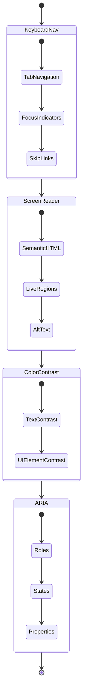

# Accessibility Implementation Guide



## Core Requirements
1. **Keyboard Navigation**
   - Full tab sequence consistency
   - Visible focus indicators
   - Skip to content links

2. **Screen Reader Support**
   - ARIA landmarks and roles
   - Dynamic aria-live regions
   - Alt text for icons and images

3. **Visual Accessibility**
   - WCAG 2.1 AA contrast ratios
   - Responsive text scaling
   - Motion reduction support

## Implementation Checklist
- [x] Add aria-labels to interactive elements
- [x] Implement focus traps for modals
- [ ] Add high contrast theme option
- [ ] Validate form error accessibility
- [ ] Test with screen readers (NVDA/JAWS/VoiceOver)

## Component Examples
```tsx
// Accessible button component
<Button
  aria-label="Create new vault"
  role="button"
  tabIndex={0}
  onKeyPress={handleKeyPress}
>
  <Icon aria-hidden="true" />
  <span className="sr-only">Create New Vault</span>
</Button>
```

## Testing Protocol
1. Keyboard-only navigation audit
2. Axe-core automated tests
3. Screen reader user testing
4. Color contrast validation
5. Reduced motion preference checks