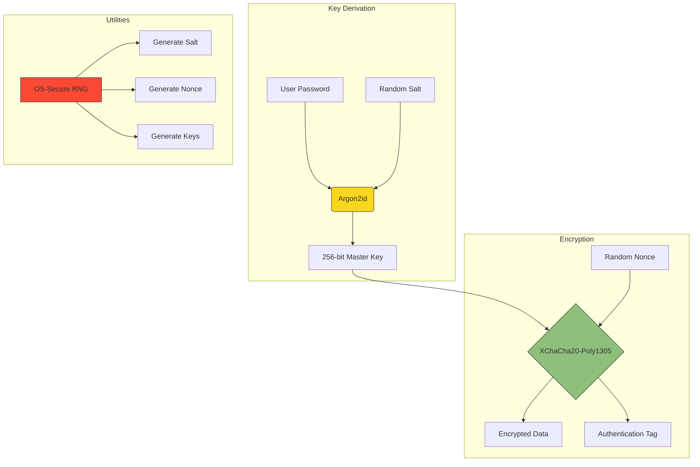

# Cryptographic Architecture



## Core Components

### 1. Key Derivation (`argon2.rs`)
```rust
pub fn derive_key_argon2id(
    password: &[u8],
    salt: &[u8],
    memory_kib: u32,  // 64MB default
    iterations: u32,   // 3 iterations
    parallelism: u32,  // 4 threads
    hash_len: u32      // 32 bytes (256-bit)
) -> Result<Vec<u8>, CryptoError>
```
Uses Argon2id algorithm with:
- Memory-hard computation
- Time-resistant parameters
- Salted input protection

### 2. Encryption (`chacha.rs`)
```rust
pub fn encrypt_xchacha20poly1305(
    key_bytes: &[u8],   // 32-byte key
    nonce_bytes: &[u8], // 24-byte nonce
    plaintext: &[u8]
) -> Result<Vec<u8>, CryptoError>
```
Features:
- 256-bit XChaCha20 stream cipher
- Poly1305 MAC authentication
- Extended 192-bit nonce
- AEAD (Authenticated Encryption with Associated Data)

### 3. Random Generation (`random.rs`)
```rust
pub fn generate_random_bytes(len: usize) -> Result<Vec<u8>, CryptoError> {
    let mut bytes = vec![0u8; len];
    OsRng.try_fill_bytes(&mut bytes)?;
    Ok(bytes)
}
```
Securely generates:
- Salts (16 bytes)
- Encryption keys (32 bytes)
- Nonces (24 bytes)

## Security Parameters
| Component       | Constant           | Value | Source |
|-----------------|--------------------|-------|--------|
| Key Derivation  | `SALT_LEN`         | 16    | NIST SP 800-63B |
| Encryption      | `KEY_LEN`          | 32    | XChaCha20 spec |
| Nonce           | `NONCE_LEN`        | 24    | IETF RFC 8439 |