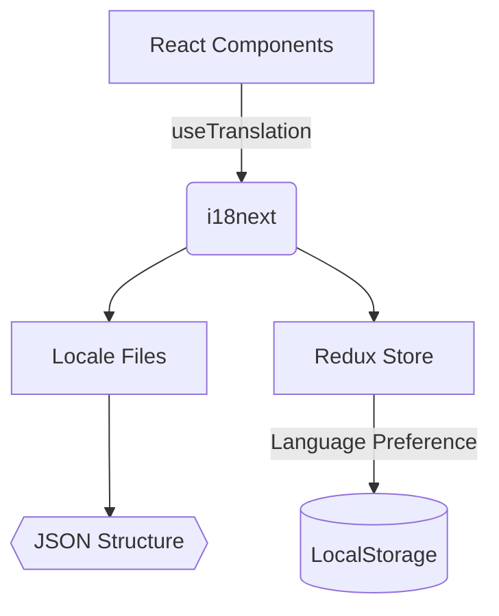

# Internationalization (i18n) System



## Configuration Setup
```typescript
// src/i18n/index.ts
import i18n from "i18next";
import { initReactI18next } from "react-i18next";
import { store } from "../redux/store";
import en from "./locales/en.json";
import es from "./locales/es.json";

i18n.use(initReactI18next).init({
  resources: { en, es },
  lng: localStorage.getItem('i18nextLng') || 'en',
  interpolation: { escapeValue: false }
});

// Redux synchronization
store.subscribe(() => {
  const lang = store.getState().preferences?.preferences?.language;
  if (lang && lang !== i18n.language) {
    i18n.changeLanguage(lang);
    localStorage.setItem('i18nextLng', lang);
  }
});
```

## Translation File Structure
```json
// src/i18n/locales/en.json
{
  "home": {
    "vaultSelector": {
      "title": "Select Vault",
      "createNew": "Create New Vault",
      "importExisting": "Import Existing Vault"
    },
    "errors": {
      "invalidPassword": "Invalid password"
    }
  }
}
```

## Key Features
1. **Automatic Language Persistence**
   - Stores selected language in localStorage
   - Syncs with Redux preferences
2. **Component-Specific Namespaces**
   - Organized by feature (settings, home, vault)
   - Hierarchical JSON structure
3. **Dynamic Content Support**
   - Variable interpolation: `{{count}} items`
   - Pluralization rules
   - Contextual translations

## Adding New Languages
1. Create new locale file:
   ```bash
   src/i18n/locales/[lang].json
   ```
2. Register in i18n config:
   ```typescript
   import fr from "./locales/fr.json";
   const resources = { ..., fr };
   ```
3. Add language selector option:
   ```json
   "settings": {
     "language": {
       "en": "English",
       "es": "Español",
       "fr": "Français"
     }
   }
   ```

## Translation Guidelines
1. **Key Naming Convention**
   - Follow component hierarchy: `[feature].[subfeature].keyName`
   - Use camelCase for complex keys
2. **String Formatting**
   - Keep sentences complete for better translation context
   - Use ICU message format for plurals:
   ```json
   "itemCount": "{count, plural, one {# item} other {# items}}"
   ```
3. **Accessibility**
   - Include ARIA labels as separate keys
   - Provide context comments for translators

## Maintenance Checklist
- [ ] Verify all UI components use translation keys
- [ ] Keep en.json as source truth
- [ ] Run missing translations audit quarterly
- [ ] Test RTL layout support
- [ ] Validate date/number formats