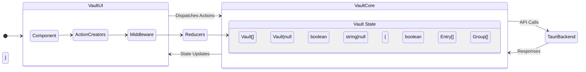
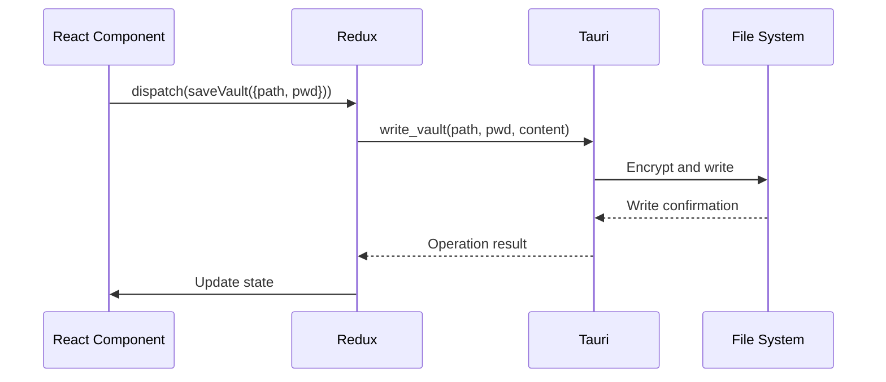

# Redux State Management Architecture



## State Structure
```typescript
interface VaultState {
  savedVaults: Vault[]          // List of known vaults
  currentVault: Vault | null    // Currently opened vault
  loading: boolean              // Async operation status
  error: string | null          // Error messages
  vaultState: {
    isLocked: boolean           // Encryption lock status
    encryptedData?: string      // Transient encrypted payload
    entries: Entry[]            // Decrypted credentials
    groups: Group[]             // Entry categorization
  }
}
```

## Key Actions
| Action Type | Purpose | Async | Payload |
|-------------|---------|-------|---------|
| `vault/addVault` | Register new vault | No | `Vault` object |
| `vault/setVaultState` | Update vault contents | No | Partial state |
| `vault/saveVault` | Persist changes | Yes | `{filePath, password}` |
| `vault/loadVault` | Decrypt and load | Yes | `{filePath, password}` |

## Persistence Flow
1. UI triggers save action
2. Redux thunk collects current entries
3. Serialize and encrypt via Tauri command
4. Update state with save result
5. Persist metadata to settings store (excluding sensitive data)



## Testing Practices
- State shape validation
- Action type consistency checks
- Reducer pure function tests
- Async action success/failure cases
- Mutation prevention verification

## Security Controls
- No sensitive data in persisted store
- Encrypted data cleared on vault lock
- HMAC validation before decryption
- Password never stored in Redux state