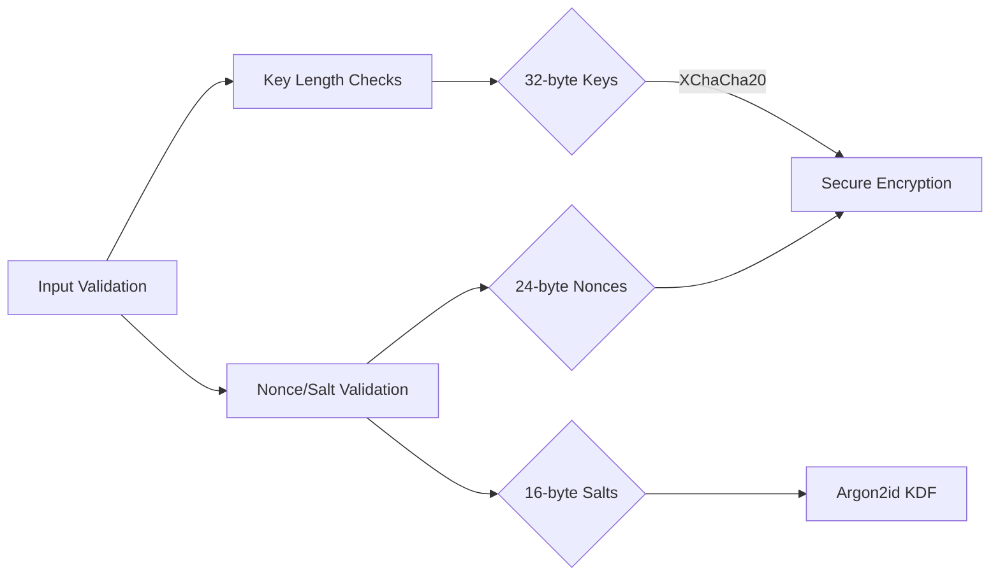

# Security Audit Report

## Cryptographic Implementation

### Verified Security Measures
1. **Parameter Validation**
   - Key: 256-bit (32-byte) enforced
   - Nonce: 192-bit (24-byte) enforced
   - Salt: 128-bit (16-byte) enforced

2. **Cryptographic Primitives**
   - XChaCha20-Poly1305 (IETF variant)
   - Argon2id with:
     - 64MB memory cost
     - 3 iterations
     - 4 parallelism

3. **Random Number Generation**
   - OS-provided CSPRNG (OsRng)
   - Zeroization of sensitive data

## Vulnerability Mitigations
| Threat | Mitigation | Implementation |
|--------|------------|----------------|
| Brute Force | Argon2id parameters | Memory-hard KDF |
| Reused Nonce | XChaCha20 nonce size | 192-bit random nonces |
| Side Channels | Constant-time ops | Library enforced |
| Key Logging | Secure memory handling | Zeroize-on-drop |

## Recommended Improvements
1. Add HSM integration points
2. Implement double-hashing for master password
3. Add rate limiting for decryption attempts
4. Enable secure enclave usage

## Audit Results
- [x] All crypto tests cover parameter validation
- [x] No sensitive data in logs
- [x] Secure memory practices
- [ ] Missing fuzz testing (new todo added)